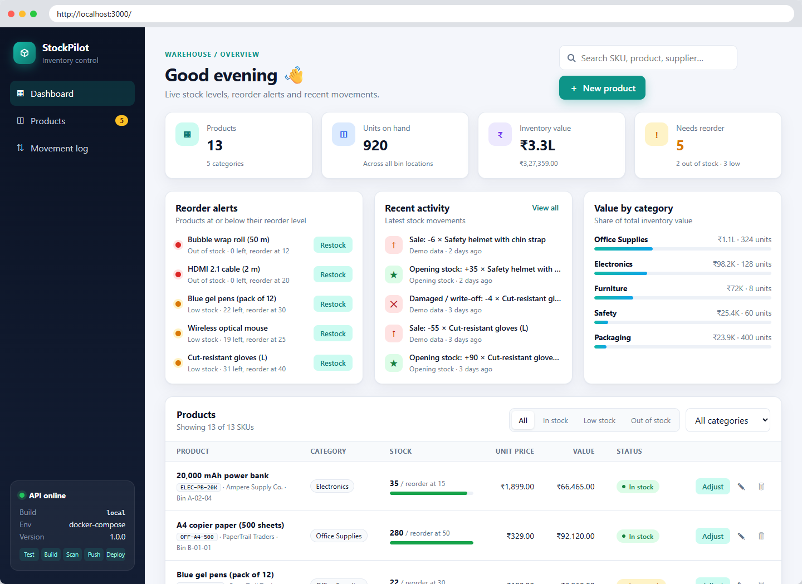
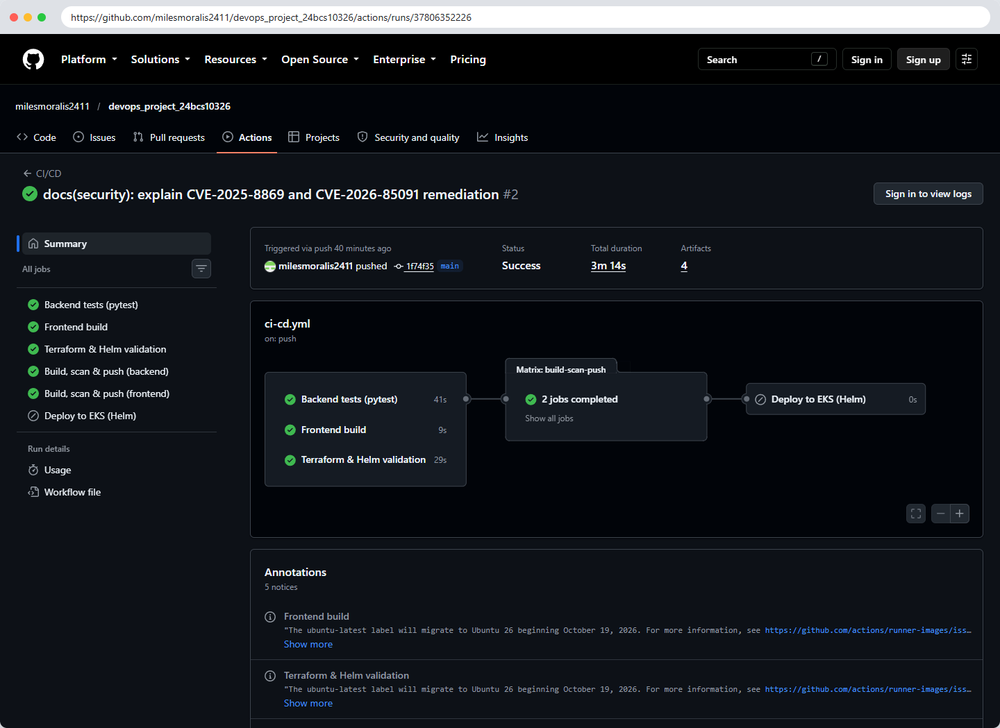
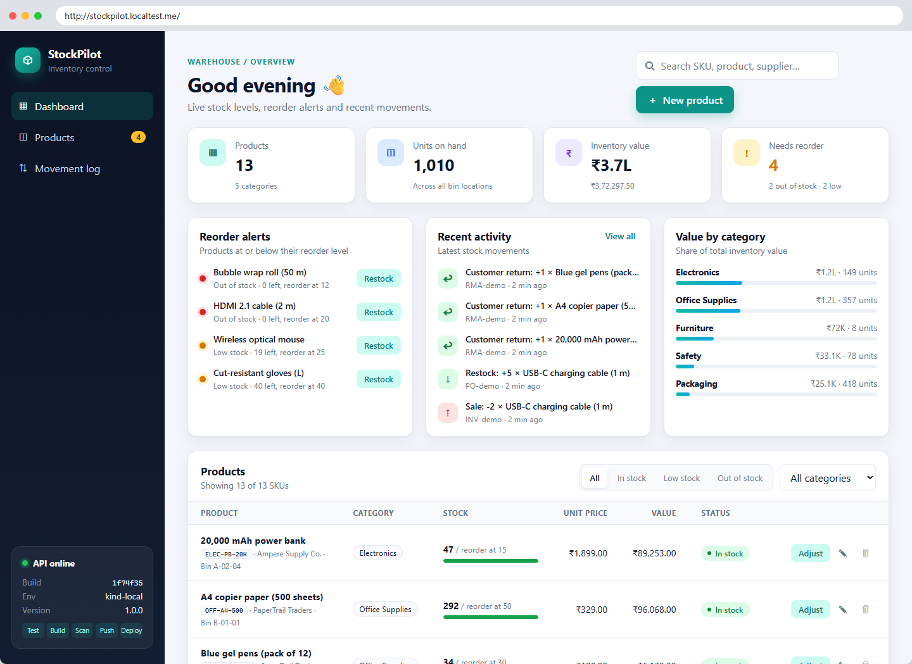
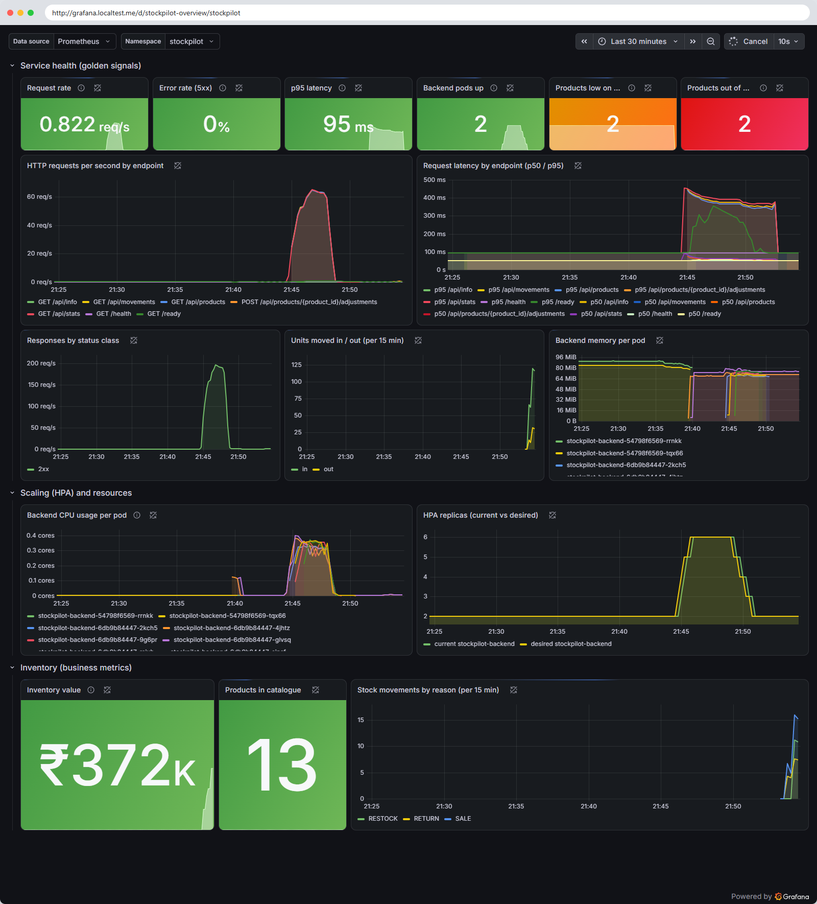

# Submission evidence (screenshots)

Every image in [`screenshots/`](screenshots/) was produced on 2026-10-08 from the real
system:

* **Terminal images** are the verbatim output of the command shown on their `$` line,
  rendered as a terminal window.
* **Browser images** are headless-Chrome captures of the live pages, framed with the URL
  that was visited.
* **CI images** are the step output downloaded from this repository's GitHub Actions logs.

| Link | URL |
|------|-----|
| Repository | https://github.com/milesmoralis2411/devops_project_24bcs10326 |
| Green pipeline run | https://github.com/milesmoralis2411/devops_project_24bcs10326/actions/runs/37806352226 |
| Backend image (GHCR) | https://github.com/milesmoralis2411/devops_project_24bcs10326/pkgs/container/stockpilot-backend |
| Frontend image (GHCR) | https://github.com/milesmoralis2411/devops_project_24bcs10326/pkgs/container/stockpilot-frontend |

Local environment: Docker Compose for M1/M4, and a 3-node **kind** Kubernetes cluster
(`scripts/local-k8s-up.sh`) with Traefik, metrics-server and kube-prometheus-stack for M8/M9.

---

## M1 - Application

| Evidence | Image |
|----------|-------|
| UI running at http://localhost:3000 (Docker Compose) | [m1-app-docker-compose.png](screenshots/m1-app-docker-compose.png) |
| Responsive layout (390 px and 820 px wide) | [../images/responsive.png](images/responsive.png) |
| `/health`, `/ready`, `/api/info` + GET/POST/PUT/DELETE smoke test | [m1-api-health-and-crud.png](screenshots/m1-api-health-and-crud.png) |
| Swagger UI with all endpoints | [m1-swagger-docs.png](screenshots/m1-swagger-docs.png) |
| PostgreSQL tables created by Alembic (`alembic_version` = `0002_create_stock_movements`) | [m1-postgres-alembic-tables.png](screenshots/m1-postgres-alembic-tables.png) |

## M2 - Testing

| Evidence | Image |
|----------|-------|
| `pytest -v`: **51 passed**, 99% coverage | [m2-pytest-v.png](screenshots/m2-pytest-v.png) |
| Same suite inside CI | [m5-ci-pytest-step.png](screenshots/m5-ci-pytest-step.png) |

## M3 - Git and GitHub

| Evidence | Image |
|----------|-------|
| Public repository | [m3-github-repository.png](screenshots/m3-github-repository.png) |
| Commit history on GitHub (20+ meaningful commits) | [m3-github-commits.png](screenshots/m3-github-commits.png) |
| `git log --oneline` | [m3-git-log.png](screenshots/m3-git-log.png) |

## M4 - Docker

| Evidence | Image |
|----------|-------|
| `docker compose up --build`: postgres, backend, frontend all **healthy** | [m4-docker-compose-up-build.png](screenshots/m4-docker-compose-up-build.png) |
| Non-root: backend uid 10001, frontend uid 101; frontend runtime stage has no Node | [m4-non-root-images.png](screenshots/m4-non-root-images.png) |
| Browser at http://localhost:3000 | [m1-app-docker-compose.png](screenshots/m1-app-docker-compose.png) |

## M5 - CI/CD

| Evidence | Image |
|----------|-------|
| Pipeline run: all jobs green (deploy skipped until AWS is configured) | [m5-github-actions-run-green.png](screenshots/m5-github-actions-run-green.png) |
| Runs triggered by pushes to `main` | [m5-github-actions-runs.png](screenshots/m5-github-actions-runs.png) |
| pytest step in CI | [m5-ci-pytest-step.png](screenshots/m5-ci-pytest-step.png) |
| Alembic migration round-trip on PostgreSQL in CI | [m5-ci-alembic-step.png](screenshots/m5-ci-alembic-step.png) |
| `docker push ghcr.io/.../stockpilot-backend:<commit SHA>` | [m5-ci-push-backend-sha-tag.png](screenshots/m5-ci-push-backend-sha-tag.png) |
| `docker push ghcr.io/.../stockpilot-frontend:<commit SHA>` | [m5-ci-push-frontend-sha-tag.png](screenshots/m5-ci-push-frontend-sha-tag.png) |
| GHCR package page: SHA-tagged versions (backend) | [m5-ghcr-backend-sha-tags.png](screenshots/m5-ghcr-backend-sha-tags.png) |
| GHCR package page: SHA-tagged versions (frontend) | [m5-ghcr-frontend-sha-tags.png](screenshots/m5-ghcr-frontend-sha-tags.png) |

## M6 - Trivy

| Evidence | Image |
|----------|-------|
| CI gate on the backend image: `severity: HIGH,CRITICAL`, `exit-code: 1`, clean | [m6-ci-trivy-gate-backend.png](screenshots/m6-ci-trivy-gate-backend.png) |
| CI gate on the frontend image | [m6-ci-trivy-gate-frontend.png](screenshots/m6-ci-trivy-gate-frontend.png) |
| CVEs found by the first run: pip (CVE-2025-8869 and 5 more) | [m6-ci-run1-cves-found-backend.png](screenshots/m6-ci-run1-cves-found-backend.png) |
| CVE found by the first run: zlib CVE-2026-85091 | [m6-ci-run1-cves-found-frontend.png](screenshots/m6-ci-run1-cves-found-frontend.png) |
| After remediation: 0 fixable vulnerabilities at any severity | [m6-trivy-local-after-fix.png](screenshots/m6-trivy-local-after-fix.png) |

Written explanation: [SECURITY.md](SECURITY.md#trivy-container-scanning-what-it-does-and-what-the-result-means).

## M7 - Terraform

> **Still to do with your AWS account.** No AWS credentials were available when these were
> captured, so the images below prove the code is valid and plans cleanly **against mocked
> AWS providers**. They are not the real `terraform plan`. Add the real screenshots with
> [AWS-EKS-GUIDE.md](AWS-EKS-GUIDE.md):
> `terraform plan` · AWS Console VPC + EKS in ap-south-1 · `terraform destroy` (`scripts/eks-teardown.sh`).

| Evidence | Image |
|----------|-------|
| `terraform fmt -check`, `init`, `validate`: valid | [m7-terraform-fmt-init-validate.png](screenshots/m7-terraform-fmt-init-validate.png) |
| `terraform test`: plans 59 / 64 resources, 3 tests passed (mocked AWS) | [m7-terraform-test-mocked-plan.png](screenshots/m7-terraform-test-mocked-plan.png) |
| Planned VPC, 2 public + 2 private subnets, NAT, EKS cluster, node group (mocked AWS) | [m7-terraform-planned-resources-mocked.png](screenshots/m7-terraform-planned-resources-mocked.png) |
| `terraform.tfvars.example` (no credentials committed) | [../terraform/terraform.tfvars.example](../terraform/terraform.tfvars.example) |

## M8 - Kubernetes + Helm (local kind cluster)

| Evidence | Image |
|----------|-------|
| `kubectl apply -f k8s/namespace.yaml`, `kubectl get pods`: 5/5 Running, 2 backend + 2 frontend | [m8-kubectl-get-pods.png](screenshots/m8-kubectl-get-pods.png) |
| `kubectl get svc` (ClusterIP), Ingress rules `/api` → backend, `/` → frontend, HPA, PDB | [m8-kubectl-svc-ingress-hpa.png](screenshots/m8-kubectl-svc-ingress-hpa.png) |
| `helm list`, `helm history`, `helm test` → Succeeded | [m8-helm-list-and-test.png](screenshots/m8-helm-list-and-test.png) |
| App through the Ingress hostname | [m8-app-via-ingress.png](screenshots/m8-app-via-ingress.png) |
| Swagger through the Ingress | [m8-swagger-via-ingress.png](screenshots/m8-swagger-via-ingress.png) |
| HPA scaling 2 → 6 pods under load, then back | [m8-hpa-autoscaling.png](screenshots/m8-hpa-autoscaling.png) |

## M9 - Observability

| Evidence | Image |
|----------|-------|
| `curl /metrics`: Prometheus format (HTTP + business metrics) | [m9-metrics-endpoint.png](screenshots/m9-metrics-endpoint.png) |
| Prometheus target `serviceMonitor/stockpilot/stockpilot-backend/0`: **UP** | [m9-prometheus-targets-up.png](screenshots/m9-prometheus-targets-up.png) |
| PromQL graph of request rate per endpoint | [m9-prometheus-query.png](screenshots/m9-prometheus-query.png) |
| Alert rules loaded | [m9-prometheus-alert-rules.png](screenshots/m9-prometheus-alert-rules.png) |
| Grafana dashboard: all panels populated (traffic, latency, CPU, HPA, inventory) | [m9-grafana-dashboard.png](screenshots/m9-grafana-dashboard.png) |

## M10 - Documentation and presentation

* `README.md` in the repository root explains the application, architecture and every module.
* The live demo (*commit → pipeline → deployment update*) is yours to present, see [DEMO-SCRIPT.md](DEMO-SCRIPT.md).
  The UI sidebar shows the deployed commit SHA, which makes the update visible.
